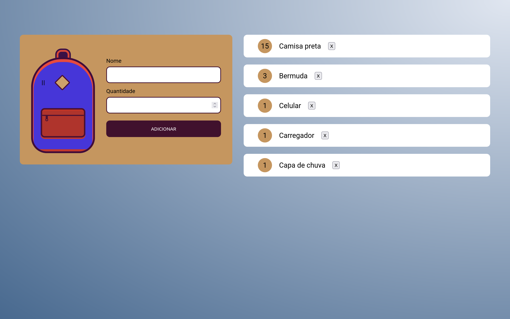

# mochila-de-viagem

Esse projeto tem o objetivo de possibilitar a criação de uma lista de coisas para  levar em uma viagem na tela do browser do usuário, e aqui faço uso de um recurso
do browser chamado de localStorage onde guardo essas informações para serem consultadas posteriormente, pois após essa lista criada podemos atualizar a tela do
browser que os dados ainda estarão lá para serem consultados.

Acesse agora a <a href="https://mochila-de-viagem-roan.vercel.app/">demo</a> e confira o deplay do projeto 🚀.

## Tecnologias utilizadas 🛠️
*  HTML5
*  CSS3
*  JAVASCRIPT

## Funcionalidades do projeto
1. [x] Criando  um novo elemento em tela
2. [x] Salvando o elemento no localStorage do browser
3. [x] Atualiza a quantidade do elemento se caso ele já existe em tela
4. [x] Criando um botão com o um “X” que deleta o elemento ao ser clicado
5. [ ] Construção do layout mobile

## Status do projeto

🚧 Em construção 🚧

